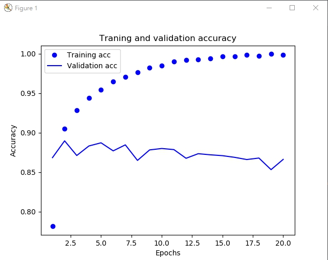
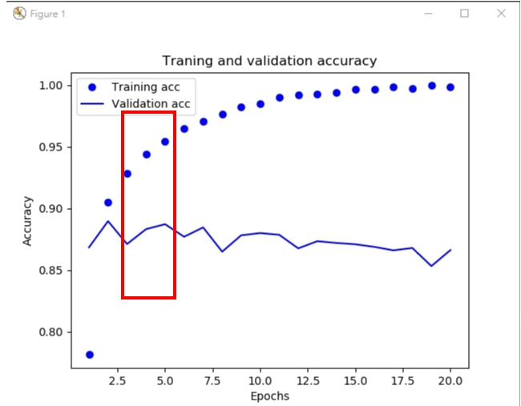
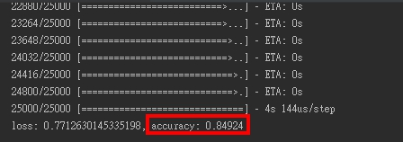

In first time, someone set the epochs to 20 times. 

the picture below is training and validation accuracy result for 20 times epoch.

According to this, you will know the training only fit for the train data (overfitting). not for another situation.

So, someone (the writer XD) according to the picture found the best period (between 3 ~ 5) to get higher accuracy.

Overfitting train result (epoch 20)
------------
[code](overfit.py)

Evaluate result (epoch 4)
----------------
[code](comment%20classification.py)

