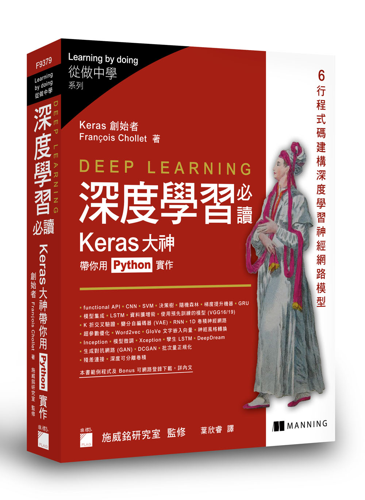

Notes for Deep Learning with Python
=============================
Implementation by the book **Deep Learning with Python**.

Chapters
----------
 - [x] 2 開始之前：了解神經網路的數學概念 [link](./Chapter2)
 - [x] 3 開始使用神經網路 [link](./Chapter3)
 - [ ] 4 機器學習的基礎知識
 - [ ] 5 深度學習實務電腦視覺的深度學習
 - [ ] 6 應用於文字資料與序列資料的深度學習 
 - [ ] 7 進階深度學習的最佳實作方式
 - [ ] 8 生成式深度學習
 - [ ] 9 結語

Ref
--------
ISBN：9781617294433

